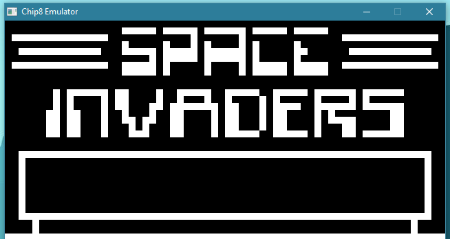
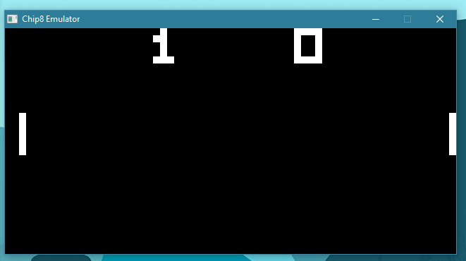

## A simple Chip-8 Emulator for Windows written in C

  

  

Chip8 is an interpreter from the 1970s that was used to develop games like Space Invaders and Pong. This project implements the Chip-8 ISA as well as virtual hardware for the keyboard and display.

The Chip-8 features a simple ISA - originally consisting of 36 instructions. The Super Chip-48 extended this to 46. This project implements only the Chip-8 ISA and ignores the Super Chip-48 instructions.

### Chip-8 Register Specifications
* 16 8-bit data registers V0 to VF.
* 16-bit I register to hold memory addresses. Only the least significant 12-bits are used.
* 16-bit Program counter (PC). Only the least significant 12-bits are used.
* Stack consisting of 16 16-bit entries to hold return addresses.
* 8-bit Stack Pointer (SP) which points at the top of the stack.
* An 8-bit Delay Timer (DT) and an 8-bit Sound Timer (ST).

### Chip-8 Memory Specifications
* Chip-8 uses a 4KB memory region. All addresses are 12-bits wide.
* Chip-8 interpreter data is loaded at address 0x0.
* Chip-8 program data is loaded from address 0x200.
* All instructions are aligned at 2 bytes. Sprites are padded to respect this alignment criteria.

### Program dependencies
* SDL - The project depends on SDL to implement the virtual hardware, including the display and keyboard.
* MinGW compiler - This project assumes that the compiler being used is MinGW-gcc for Windows.

**Note:** If you would like to use a different C/C++ compiler for Windows and/or wish to use an IDE with an automated build process, configure your IDE to look in the right directories for includes/libs/binaries and avoid using the provided Makefile.

### Running the emulator
After the program has been successfully built, you can run the executable located in the **bin** folder. Roms for Space Invaders and Pong have also been provided, but keep in mind that Space Invaders currently has some issues with the game speed.

## Useful Links:
* You can find the tutorial I followed here: [Creating a Chip-8 Emulator in C.](https://www.udemy.com/course/creating-a-chip-8-emulator-in-c/)
* [Chip-8 Reference Guide, including details about the ISA and hardware.](http://devernay.free.fr/hacks/chip8/C8TECH10.HTM)
